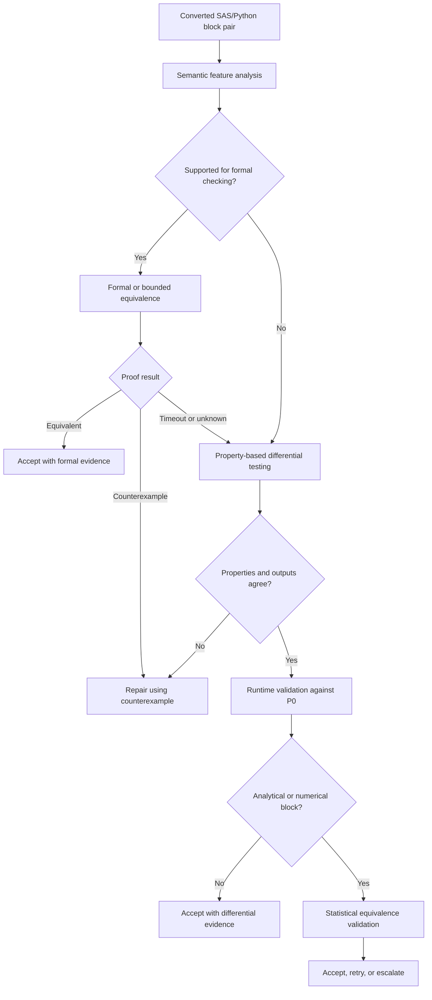

# Tiered Formal Verification for DICE-SASPy (SAS→Python Equivalence)

Code: [dice-engine](https://github.com/zhuygln/dice-engine)

> **Historical note (2026-08-05):** This plan was written under the working name **"SASaiPy"**; that system is **DICE** (specifically the DICE-SASPy instantiation). The name is retired. The engineering spec derived from this plan lives in the dice-engine repo at `docs/verification_planner_design.md`, which also carries the normative terminology table. Condensed mapping: SASaiPy → DICE / DICE-SASPy; Verification Planner → implementation of Validation Engine (V); P0 runtime comparison → mixed-runtime validation (tier V4); Top-Down decomposition → dynamic chunking (U) / `split`; Bottom-Up fallback → controller `bottom-up` action; Reblock → closure merge in K(c_t); conversion controller → deterministic controller (Φ, six actions). Body prose below is preserved as written; read "SASaiPy" as "DICE-SASPy".

## Executive Assessment

Formal verification is practical and relevant for SASaiPy, but it should not be treated as a universal mechanism for proving that every SAS program is equivalent to its Python translation.

The recommended approach is a **tiered, verification-aware validation framework**:

- Use formal or symbolic verification for simple deterministic logic.
- Use bounded verification for loops and small stateful transformations.
- Use property-based and differential testing for general data-processing blocks.
- Use runtime comparison against the SAS baseline for broader pipeline validation.
- Use statistical equivalence for forecasting, optimization, and machine-learning procedures.

The strongest positioning for SASaiPy is therefore:

> **Verification-aware translation validation:** SASaiPy selects the strongest practical verification method for each converted block and records the resulting evidence before accepting the conversion.

This approach is consistent with current academic work in verified compilation, translation validation, bounded model checking, property-based testing, and LLM-assisted program translation.

---

## 1. Relationship to Established Academic Practice

The SASaiPy verification plan is closely related to **translation validation**.

Translation validation does not require proving the entire translator correct. Instead, it validates each source and target program pair after transformation.

This is a better fit for an AI-based conversion system because the LLM itself is not formally trusted. Each generated conversion is treated as a candidate that must independently satisfy verification requirements.

Two important reference points illustrate this distinction:

### CompCert

CompCert is a formally verified compiler that proves preservation of program semantics for a defined subset of C.

It provides very strong guarantees, but those guarantees depend on:

- A formally defined source language.
- A formally defined target language.
- A verified compiler implementation.
- Deliberately restricted language coverage.

SASaiPy does not need to reproduce the CompCert model for the entire SAS language.

### Alive2

Alive2 performs translation validation for LLVM transformations.

Rather than proving every optimization pass correct, it checks whether a particular source and transformed program are semantically equivalent.

This is a closer model for SASaiPy:

```text
Original SAS block
        ↓
Generated Python block
        ↓
Semantic equivalence check
        ↓
Accept, reject, or generate a counterexample
```

SASaiPy should therefore be positioned closer to an **Alive2-style translation validation system** than to a fully verified compiler.

---

## 2. Relationship to Recent LLM Code-Translation Research

Recent research supports combining LLM-generated translations with formal and automated validation.

Examples include systems that:

- Translate source code using an LLM.
- Partition larger projects into smaller translation units.
- Use property-based testing or bounded model checking.
- Generate counterexamples when equivalence fails.
- Repair translations using concrete failure evidence.
- Escalate unsupported language features.

These findings support several design decisions already present in SASaiPy:

- Block-by-block conversion.
- Top-Down decomposition.
- Bottom-Up fallback for small internal macros.
- Bounded retry loops.
- Typed failure classification.
- Validation before acceptance.
- Reblock only after successful conversion.

The SASaiPy contribution is broader because it adds repository-level orchestration and hybrid SAS/Python pipeline control around these verification mechanisms.

---

## 3. Alignment with Current Industry Practice

Current enterprise modernization platforms typically depend on:

- Build and compile checks.
- Regression testing.
- Legacy-versus-modernized output comparison.
- Generated test plans.
- Human review.
- Incremental modernization workflows.
- IDE integration.

Universal formal proof is not the industry default.

The normal industry baseline is closer to:

```text
Translate
   ↓
Build
   ↓
Run tests
   ↓
Compare legacy and modernized behavior
   ↓
Review and approve
```

Formal verification can therefore differentiate SASaiPy, but it should complement rather than replace conventional testing.

A practical industry-ready SASaiPy design should combine:

- Formal evidence where feasible.
- Runtime evidence where necessary.
- Statistical evidence where exact equivalence is not meaningful.
- Human approval for unsupported or high-risk transformations.

---

## 4. SAS Constructs That Are Good Candidates for Formal Verification

### 4.1 Highly Practical

The following constructs are strong candidates for SMT-based or symbolic equivalence checking:

- Scalar arithmetic expressions.
- Boolean expressions.
- Assignments.
- Simple `IF/THEN/ELSE` branches.
- Deterministic row filters.
- Column derivations.
- Bounded loops.
- Simple date calculations.
- Internal macros with explicit inputs and outputs.
- Small transformations without external side effects.

For these blocks, SASaiPy can attempt to prove:

\[
orall x \in D, \quad f_{SAS}(x) = f_{Python}(x)
\]

The solver can also search for a counterexample:

\[
\exists x \in D, \quad f_{SAS}(x) \neq f_{Python}(x)
\]

A counterexample is especially valuable because it can be converted into:

- A regression test.
- A repair prompt.
- A validation artifact.
- A reusable edge case.

### 4.2 Practical with Bounds or Restrictions

Some constructs are suitable for bounded verification:

- Loops over bounded ranges.
- Bounded arrays.
- Small joins.
- Small group-by operations.
- Strings with bounded length.
- Macro branches with bounded parameters.
- Small stateful DATA-step transformations.
- Finite symbolic datasets.

For these cases, SASaiPy should report qualified results such as:

- `proved_within_bounds`
- `no_counterexample_found_within_bounds`
- `timed_out`
- `unsupported_semantics`

It should not present bounded verification as unrestricted proof.

### 4.3 Usually Unsuitable for Exact Formal Proof

The following areas are generally poor candidates for complete formal equivalence:

- Proprietary SAS procedures.
- Forecasting procedures.
- Optimization procedures.
- Stochastic algorithms.
- Machine-learning training.
- External databases.
- File-system side effects.
- Dynamic macro-generated code.
- Large unrestricted joins.
- Parallel CAS execution.
- Environment-dependent sorting or collation.
- Floating-point pipelines with implementation-dependent order.

These cases should use other verification methods.

---

## 5. Why DICE-SASPy Needs a Semantic Compatibility Layer

The primary challenge is not the solver. The main challenge is defining equivalence across SAS and Python semantics.

Potential differences include:

- Missing-value behavior.
- SAS special missing values.
- Type coercion.
- Character and numeric conversion.
- Sorting rules.
- Collation.
- Row ordering.
- Aggregation defaults.
- Formatted versus internal values.
- Date and datetime representation.
- Floating-point behavior.
- Macro-variable expansion.
- DATA-step execution semantics.
- Retained variables.
- BY-group processing.
- `FIRST.` and `LAST.` variables.
- Merge behavior.

For example, a direct translation may appear syntactically equivalent but differ because:

- SAS missing values sort differently.
- pandas nullable Boolean expressions can propagate unknown values.
- SAS may perform implicit coercion.
- Python may raise an error where SAS produces a missing value.
- Aggregation order may change floating-point output.

SASaiPy therefore needs a **SAS semantic compatibility layer** that explicitly models the supported subset.

A practical initial semantic model should cover:

1. Numeric and character values.
2. Missing and special missing values.
3. Boolean and comparison rules.
4. Date and datetime conversions.
5. Simple DATA-step assignment behavior.
6. Conditional logic.
7. Selected SAS intrinsic functions.
8. Bounded loops.
9. Deterministic row-level transformations.

---

## 6. Recommended Verification Architecture

SASaiPy should replace a single validation step with a **Verification Planner**.



The planner should choose the strongest verification method that is:

- Semantically applicable.
- Computationally practical.
- Appropriate for the block’s risk level.
- Supported by the available language model.

---

## 7. Recommended Verification Tiers

| Tier | Method | Suitable Code | Evidence |
|---|---|---|---|
| V0 | Parse, type, and interface checks | All blocks | Structural compatibility |
| V1 | Exact formal equivalence | Expressions, assignments, simple control flow | Proof or counterexample |
| V2 | Bounded equivalence | Loops, small stateful blocks, bounded collections | Bound-qualified result |
| V3 | Property-based differential testing | DATA steps, joins, transformations | Generated cases and minimized failures |
| V4 | P0 runtime equivalence | General executable blocks | Dataset and artifact comparison |
| V5 | Statistical equivalence | Forecasting, optimization, ML | Metric and tolerance report |
| V6 | Human review | Unsupported or high-risk behavior | Explicit approval and rationale |

### Tier V0 — Structural Validation

Applicable to all converted blocks.

Checks include:

- Parsing.
- Syntax.
- Imports.
- Type compatibility.
- Input schema.
- Output schema.
- Function signatures.
- Dependency availability.

### Tier V1 — Exact Formal Equivalence

Best for:

- Arithmetic.
- Predicates.
- Assignments.
- Simple branches.
- Pure functions.

Expected outputs:

- `proved`
- `counterexample_found`
- `unknown`
- `unsupported`

### Tier V2 — Bounded Equivalence

Best for:

- Loops.
- Bounded arrays.
- Small symbolic datasets.
- Limited stateful behavior.

Evidence must include the bounds used.

### Tier V3 — Property-Based Differential Testing

Best for data transformations that are too complex for formal proof but can be tested over generated inputs.

Possible properties:

- Row count preserved.
- Keys preserved.
- Sorting preserved.
- Missing values preserved.
- Uniqueness preserved.
- Monotonicity preserved.
- Aggregation totals preserved.
- Schema preserved.

### Tier V4 — P0 Runtime Equivalence

Run both the original SAS implementation and the hybrid or Python implementation.

Compare:

- Output datasets.
- Schemas.
- Row counts.
- Column values.
- Sort order.
- Logs.
- Artifacts.
- Runtime behavior.

### Tier V5 — Statistical Equivalence

Use for:

- Forecasting.
- Optimization.
- Machine learning.
- Numerical procedures.

Possible evidence:

- MAE.
- RMSE.
- WAPE.
- WMAPE.
- MAPE.
- Absolute bias.
- Prediction intervals.
- Distributional similarity.
- Stability across seeds.
- Business-rule tolerance.

### Tier V6 — Human Review

Required when:

- Semantics are unsupported.
- External effects cannot be reproduced.
- Test coverage is insufficient.
- Statistical differences exceed thresholds.
- The block is business-critical.
- The solver returns inconclusive results.

---

## 8. Verification Certificates

SASaiPy should not represent verification as a single Boolean value.

Avoid:

```yaml
equivalent: true
```

Use a structured certificate instead:

```yaml
verification:
  method: bounded_symbolic_equivalence
  status: proved_within_bounds
  source_semantics: sasai-ir-v0.3
  target_semantics: pandas-profile-v0.2

  assumptions:
    - no special SAS missing values
    - no external side effects
    - deterministic execution
    - input rows <= 8
    - character length <= 32

  bounds:
    loop_iterations: 20
    input_rows: 8

  numerical_policy:
    mode: exact

  counterexample: null
```

A certificate should record:

- Verification method.
- Status.
- Semantic model version.
- Assumptions.
- Bounds.
- Numeric tolerance.
- Tool version.
- Counterexample, if any.
- Runtime and resource usage.
- Validation date.
- Source and target code hashes.

---

## 9. Integration with the DICE-SASPy Conversion Workflow

Formal verification fits naturally into the existing SASaiPy workflow.

### Unified Control Loop

```text
Top-Down decomposition
→ convert block
→ select strongest verification method
→ accept, repair, or revert
→ hybrid complexity exceeds threshold
→ Bottom-Up conversion of simple internal macros
→ formally verify eligible internal macros
→ integrate verified Python components
→ Reblock
→ revalidate merged Python block
→ resume Top-Down
```

### Top-Down Conversion

Top-Down blocks may vary widely in complexity.

The Verification Planner should classify each block and select:

- Formal verification.
- Bounded verification.
- Property testing.
- P0 comparison.
- Statistical validation.

### Bottom-Up Fallback

Bottom-Up fallback is particularly well suited to formal verification because it targets:

- Small internal macros.
- No nested macro calls.
- Limited dependencies.
- Simple logic.
- Explicit interfaces.

These are the strongest formal-verification candidates.

### Reblock

Reblock merges multiple validated pure-Python blocks.

The merged block should still be revalidated because merging may change:

- Operation ordering.
- Intermediate materialization.
- Mutation behavior.
- Aliasing.
- Exception behavior.
- Floating-point accumulation.
- Observable intermediate outputs.

For pure deterministic functions, compositional proof may be sufficient.

For pandas-based pipelines, runtime validation against P0 will often be safer and less expensive.

---

## 10. Practical MVP Recommendation

SASaiPy should not attempt to formalize the full SAS language in the MVP.

Instead, define a **SASaiPy Verifiable Subset v0.1**.

### 10.1 Supported in v0.1

- Numeric expressions.
- Boolean expressions.
- Assignments.
- Simple filtering.
- `IF/THEN/ELSE`.
- Bounded `DO` loops.
- Selected SAS intrinsic functions.
- Simple internal macros.
- Deterministic row-level transformations.
- No external I/O.
- No proprietary procedures.
- No nested macros.

### 10.2 MVP Implementation

1. Parse supported SAS into a small intermediate representation.
2. Represent generated Python using the same intermediate representation or a matching symbolic model.
3. Encode equivalence constraints in an SMT solver such as Z3.
4. Return:
   - proof;
   - counterexample;
   - timeout;
   - unknown;
   - unsupported.
5. Convert counterexamples into concrete regression tests.
6. Fall back automatically to property-based differential testing.
7. Store all evidence in the conversion registry.
8. Surface the result in the VS Code SASaiPy agent.

### 10.3 Good Pilot Cases

- Arithmetic utility macro.
- Missing-value normalization.
- Date-window calculation.
- Deterministic categorization.
- Bounded iterative adjustment.
- Multi-condition row filter.
- Simple column derivation.
- Small internal macro with explicit inputs and outputs.

### 10.4 Poor Initial Pilot Cases

Do not begin with:

- `PROC HPF`.
- Forecasting ensembles.
- Optimization.
- Machine-learning procedures.
- Complex DATA-step merges.
- Dynamic macro-generated code.
- External database access.
- File-system side effects.

---

## 11. Suggested DICE-SASPy Agent Experience

The VS Code agent could expose commands such as:

```text
/sasai-verify
/sasai-explain-proof
/sasai-generate-counterexample
/sasai-run-differential-tests
/sasai-show-assumptions
/sasai-compare-p0
```

Example user flow:

```text
1. Convert selected SAS block.
2. Analyze supported semantics.
3. Attempt formal equivalence.
4. If proof succeeds, generate a verification certificate.
5. If proof fails, show the counterexample.
6. Ask the LLM to repair the Python implementation.
7. Retry within the configured budget.
8. Fall back to differential testing if formal verification is unsupported.
```

---

## 12. Risks and Mitigations

| Risk | Impact | Mitigation |
|---|---|---|
| SAS semantics are incompletely modeled | High | Define a narrow supported subset and version the semantic model |
| Solver performance is unpredictable | Medium | Use timeouts, bounds, caching, and fallbacks |
| Bounded proof is misunderstood as universal proof | High | Use qualified status labels and explicit certificates |
| Floating-point differences produce false failures | Medium | Add configurable exact, tolerance, and statistical modes |
| External side effects cannot be modeled | High | Require runtime validation and human review |
| LLM repair loops repeat without progress | Medium | Use typed failures, counterexamples, bounded retries, and rollback |
| Formal verification adds excessive latency | Medium | Apply it selectively based on risk and semantic suitability |
| Reblock invalidates previous evidence | Medium | Revalidate merged blocks and preserve lineage |

---

## 13. Research Positioning

A defensible research contribution is not:

> SASaiPy formally verifies all SAS-to-Python migration.

A stronger claim is:

> **DICE-SASPy is a verification-aware migration controller that dynamically selects formal, bounded, differential, property-based, runtime, or statistical validation according to the semantic characteristics of each converted block.**

This connects SASaiPy to:

- Translation validation.
- Verified compilation.
- Symbolic execution.
- Bounded model checking.
- Property-based testing.
- Differential testing.
- LLM-guided repair.
- Repository-level code migration.
- Hybrid execution.
- Convergence-controlled agents.

Potential research questions include:

1. How accurately can the system classify blocks by appropriate verification strategy?
2. How much does formal verification reduce undetected semantic regressions?
3. Do counterexample-guided repair loops outperform log-only repair?
4. What percentage of real SAS code falls within the verifiable subset?
5. How does verification cost scale with block size and semantic complexity?
6. Does Bottom-Up fallback increase the proportion of formally verifiable code?
7. Can verification evidence improve controller convergence decisions?
8. Does Reblock preserve previously established equivalence evidence?

---

## 14. Overall Assessment

### Practicality by Scope

| Scope | Practicality |
|---|---|
| Simple deterministic expressions | High |
| Internal simple macros | Very high |
| Bounded loops and small stateful blocks | Moderate to high |
| General DATA-step transformations | Moderate |
| Proprietary SAS procedures | Low for formal proof |
| Forecasting and ML procedures | Low for exact proof, high for statistical validation |
| Entire SAS repositories | Low for universal formal proof |
| Tiered verification portfolio | High |

### Industry Relevance

High.

Industry modernization currently relies heavily on testing, regression comparison, and human review. Adding formal and symbolic validation for eligible blocks would provide stronger assurance without requiring the entire modernization platform to become a verified compiler.

### Academic Relevance

High.

The design is well aligned with active research in program translation, formal methods, LLM-generated code validation, counterexample-guided repair, and agent-controlled software transformation.

### Final Recommendation

Proceed with a limited formal-verification capability as part of the SASaiPy MVP or early research prototype, but constrain the scope to a clearly defined semantic subset.

The recommended priority is:

```text
1. Define the verifiable SAS subset.
2. Build the common intermediate representation.
3. Add SMT-based equivalence for simple blocks.
4. Add counterexample generation.
5. Add property-based fallback.
6. Integrate evidence into the conversion controller.
7. Expand semantics only after evaluating real SAS repositories.
```

Formal verification should be treated as a **high-assurance verification tier**, not as the sole definition of equivalence.
