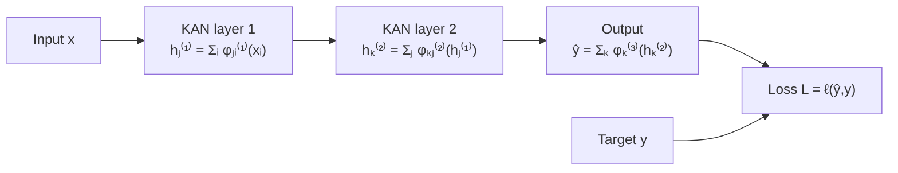
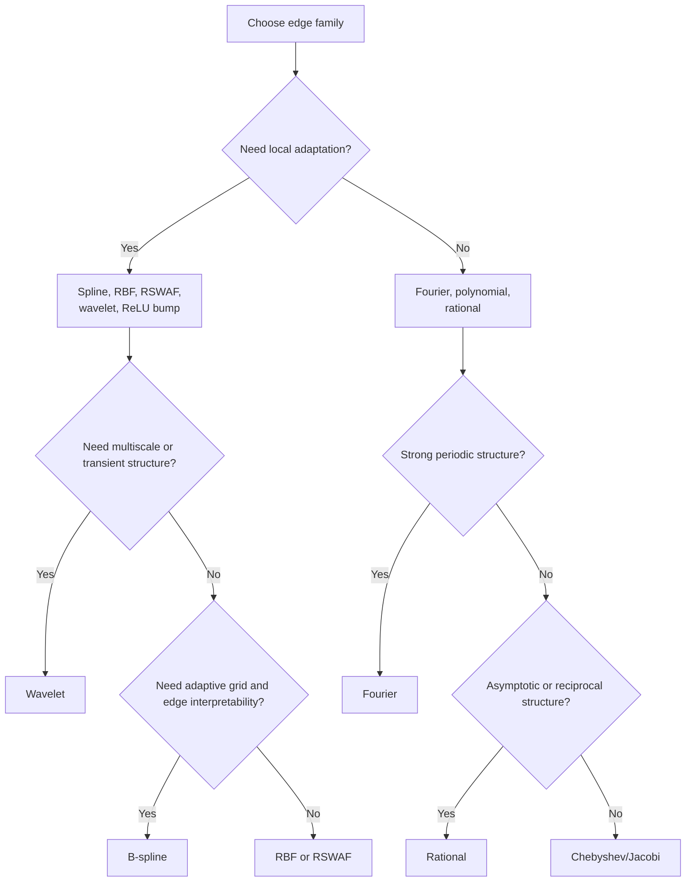

# KAN Edge Functions in the MLP Training Framework

## 1. Purpose

A Kolmogorov–Arnold Network (KAN) uses the same overall training loop as a multilayer perceptron (MLP):

\[
\text{input}\rightarrow\text{prediction}\rightarrow\text{loss}
\rightarrow\text{backpropagation}\rightarrow\text{parameter update}.
\]

The architectural change is inside each layer. An MLP learns a scalar weight on each edge and usually applies a fixed activation at each node. A KAN places a learnable one-dimensional function on each edge.

The edge-function family determines:

- the shapes an edge can represent;
- whether learning is local or global over the input domain;
- gradient behavior;
- parameter count and computational cost;
- sensitivity to normalization;
- interpolation and extrapolation;
- smoothness and derivative quality;
- suitability for periodic, multiscale, localized, or asymptotic patterns;
- interpretability of learned edge curves.

---

## 2. From an MLP edge to a KAN edge

### 2.1 MLP layer

For an MLP:

\[
z_j=\sum_{i=1}^{d_{\text{in}}}w_{ji}x_i+b_j,
\qquad
h_j=\sigma(z_j).
\]

Each edge contributes:

\[
w_{ji}x_i.
\]

The learned object on an edge is one scalar \(w_{ji}\).

```text
MLP edge:

xᵢ ── multiply by wⱼᵢ ──> contribution to node j
```

### 2.2 KAN layer

A KAN layer computes:

\[
h_j=\sum_{i=1}^{d_{\text{in}}}\phi_{ji}(x_i),
\]

where \(\phi_{ji}\) is a trainable univariate function.

```text
KAN edge:

xᵢ ── learned function φⱼᵢ(·) ──> contribution to node j
```

A two-hidden-layer KAN can be written as:

\[
h_j^{(1)}=\sum_i\phi_{ji}^{(1)}(x_i),
\]

\[
h_k^{(2)}=\sum_j\phi_{kj}^{(2)}\left(h_j^{(1)}\right),
\]

\[
\hat y=\sum_k\phi_k^{(3)}\left(h_k^{(2)}\right).
\]

The loss remains:

\[
L=\ell(\hat y,y).
\]



---

## 3. General KAN edge parameterization

Many edge families can be expressed as:

\[
\phi(x)
=
a\,b(x)
+
s\sum_{r=1}^{R}c_r\psi_r(T(x;\eta)).
\]

Here:

- \(b(x)\) is an optional residual/base function;
- \(a\) is its learned scale;
- \(\psi_r\) is a basis function;
- \(c_r\) is a learned coefficient;
- \(s\) is an optional basis scale;
- \(T(x;\eta)\) normalizes, translates, or rescales the input;
- \(\eta\) may contain knots, centers, widths, frequencies, or shape parameters;
- \(R\) is the number of basis functions per edge.

The original spline KAN commonly uses a base branch plus a spline expansion:

\[
\phi(x)
=
w_b\,\operatorname{SiLU}(x)
+
w_s\sum_r c_rB_r(x).
\]

The residual branch can preserve a simple route through the model while the learned basis adds detailed nonlinear structure.

---

## 4. Backpropagation through a general edge

Suppose:

\[
u=\phi(x),
\qquad
\delta=\frac{\partial L}{\partial u}.
\]

For basis coefficient \(c_r\):

\[
\frac{\partial L}{\partial c_r}
=
\delta\,s\,\psi_r(T(x;\eta)).
\]

The gradient passed to the previous layer is:

\[
\frac{\partial L}{\partial x}
=
\delta\,\phi'(x).
\]

More explicitly:

\[
\frac{\partial L}{\partial x}
=
\delta
\left[
a\,b'(x)
+
s\sum_r
c_r\psi_r'(T(x;\eta))
\frac{\partial T}{\partial x}
\right].
\]

If \(\eta\) is trainable:

\[
\frac{\partial L}{\partial\eta}
=
\delta\frac{\partial\phi(x)}{\partial\eta}.
\]

The edge family therefore controls both:

\[
\phi(x)
\quad\text{and}\quad
\phi'(x).
\]

It changes not only representational capacity, but also the optimization geometry seen by earlier layers.

---

## 5. Local versus global edge functions

### Local bases

Examples:

- B-splines;
- Gaussian radial basis functions;
- reflectional switch functions;
- many wavelets;
- compact ReLU-based bumps.

Only nearby basis components receive significant gradients for a given input.

```text
Input x lies here
                 ↓
---- B₁ ---- B₂ ---- B₃ ---- B₄ ---- B₅ ----

Mostly B₃ and neighboring basis functions are updated.
```

Advantages:

- local adaptation;
- less interference between distant regions;
- good threshold and regime modeling;
- often easier edge-level visualization.

Disadvantages:

- domain coverage matters;
- extrapolation is usually weak;
- centers or knots increase memory;
- normalization is important.

### Global bases

Examples:

- Fourier functions;
- Chebyshev, Legendre, and Jacobi polynomials;
- rational functions;
- raw monomials.

Most or all coefficients are affected by every input.

Advantages:

- compact representation of globally smooth structure;
- useful when the target has known spectral or analytic form;
- often convenient for derivatives.

Disadvantages:

- local corrections alter the curve globally;
- high-order terms can become unstable;
- scaling is critical;
- local discontinuities are inefficient to represent.

---

# 6. B-spline edges

## Definition

\[
\phi(x)=\sum_{r=1}^{R}c_rB_{r,p}(x),
\]

where \(B_{r,p}\) is a B-spline basis of degree \(p\).

An edge may include a residual branch:

\[
\phi(x)
=
w_b b(x)
+
w_s\sum_r c_rB_{r,p}(x).
\]

## Gradient locality

\[
\frac{\partial L}{\partial c_r}
=
\delta B_{r,p}(x).
\]

With a standard grid, only approximately \(p+1\) basis functions are active at one input location. Other coefficients receive exactly zero gradient from that observation.

## Inductive bias

B-splines assume the relationship is a smooth piecewise-polynomial curve. They are suitable for:

- smooth tabular effects;
- thresholds with smooth transitions;
- scientific function fitting;
- edge visualization;
- grid refinement and symbolic simplification.

## Strengths

- local shape control;
- adjustable grid resolution;
- predictable smoothness;
- strong interpolation;
- intuitive edge plots.

## Weaknesses

- more evaluation and grid-management overhead than matrix multiplication;
- adaptive grids complicate batching and deployment;
- fine grids increase overfitting and parameter count;
- out-of-grid behavior is implementation-dependent;
- extrapolation is usually weak.

## Smoothness

With simple knots, a degree-\(p\) spline is generally \(C^{p-1}\). Cubic splines are normally \(C^2\), which is useful when the loss includes first- or second-order derivatives.

## Extrapolation

Outside the knot range, an implementation may clamp, return zero, continue a boundary segment, or depend mainly on the residual branch. For future prediction or domain shift, the base branch may be crucial.

---

# 7. Gaussian RBF edges

## Definition

\[
\phi(x)
=
\sum_{r=1}^{R}
c_r
\exp\left[
-\frac{(x-\mu_r)^2}{2h_r^2}
\right].
\]

Here \(\mu_r\) is a center and \(h_r\) is a width.

## Gradients

\[
\frac{\partial L}{\partial c_r}
=
\delta
\exp\left[
-\frac{(x-\mu_r)^2}{2h_r^2}
\right].
\]

\[
\frac{\partial\phi}{\partial x}
=
\sum_r
c_r
\exp\left[
-\frac{(x-\mu_r)^2}{2h_r^2}
\right]
\left(
-\frac{x-\mu_r}{h_r^2}
\right).
\]

## Inductive bias

RBF edges build the curve from smooth localized bumps. They are useful when:

- local neighborhoods matter;
- the target is smooth;
- simple GPU-vectorized evaluation is preferred;
- an alternative to adaptive spline grids is needed.

## Strengths

- infinitely differentiable;
- simple tensor implementation;
- efficient parallel evaluation;
- local adaptation;
- easy integration into standard deep-learning code.

## Weaknesses

- all Gaussian values are technically nonzero;
- values far outside the centers may activate almost nothing;
- width selection is critical;
- narrow widths can leave gradient gaps;
- wide widths can make basis functions redundant;
- LayerNorm or another domain-control method is often helpful.

## Width trade-off

```text
Too narrow:
highly local fitting → spikes, overfitting, weak coverage

Too wide:
smooth global fitting → correlated bases, weak local resolution
```

---

# 8. Reflectional switch / sech² edges

A FasterKAN-style localized basis is:

\[
\psi(r)
=
1-\tanh^2\left(\frac{r}{h}\right)
=
\operatorname{sech}^2\left(\frac{r}{h}\right),
\qquad
r=x-\mu.
\]

An edge can be:

\[
\phi(x)
=
\sum_r
c_r
\operatorname{sech}^2
\left(
\frac{x-\mu_r}{h}
\right).
\]

Its derivative is:

\[
\frac{d}{dx}
\operatorname{sech}^2
\left(
\frac{x-\mu}{h}
\right)
=
-\frac{2}{h}
\operatorname{sech}^2
\left(
\frac{x-\mu}{h}
\right)
\tanh
\left(
\frac{x-\mu}{h}
\right).
\]

## Strengths

- smooth local basis;
- regular-grid implementation;
- standard tensor operations;
- designed for lower overhead than spline evaluation.

## Weaknesses

- center coverage and width remain important;
- naturally interpolative rather than extrapolative;
- speed claims depend on hardware and implementation;
- lacks the same adaptive-knot interpretation as splines.

Use it when a fast local KAN-like layer is more important than explicit spline-grid control.

---

# 9. Wavelet edges

## Definition

\[
\phi(x)
=
\sum_{r=1}^{R}
c_r
\psi
\left(
\frac{x-\tau_r}{s_r}
\right),
\]

where \(\psi\) is a mother wavelet, \(\tau_r\) is translation, and \(s_r\) is scale.

Possible wavelets include:

- Mexican hat;
- Morlet;
- derivative of Gaussian;
- Shannon;
- Haar-like or compactly supported wavelets.

## What wavelets add

```text
Fourier:
frequency information, global over the domain

Wavelet:
frequency-scale information localized near a position
```

## Gradients

\[
\frac{\partial L}{\partial c_r}
=
\delta
\psi\left(
\frac{x-\tau_r}{s_r}
\right).
\]

\[
\frac{\partial L}{\partial\tau_r}
=
-\delta c_r
\frac{1}{s_r}
\psi'
\left(
\frac{x-\tau_r}{s_r}
\right).
\]

\[
\frac{\partial L}{\partial s_r}
=
-\delta c_r
\frac{x-\tau_r}{s_r^2}
\psi'
\left(
\frac{x-\tau_r}{s_r}
\right).
\]

Because small \(s_r\) can create large gradients, use a positive parameterization:

\[
s_r=\operatorname{softplus}(\rho_r)+\epsilon.
\]

## Inductive bias

Wavelet edges are natural for:

- multiscale signals;
- localized oscillations;
- transient events;
- nonstationary time series;
- mixed slow and fast behavior;
- images and spectral data.

## Strengths

- multiresolution representation;
- joint localization in position and scale;
- efficient representation of transients;
- potential separation of trend, seasonality, and local shocks.

## Weaknesses

- mother-wavelet choice matters;
- scales and translations can be difficult to optimize;
- zero-mean wavelets may represent constants inefficiently;
- many scales cause parameter growth;
- boundary behavior needs care;
- a dense superposition may become hard to interpret.

A base or residual branch is especially useful for trend and constant components.

---

# 10. Fourier edges

## Definition

\[
\phi(x)
=
a_0+
\sum_{k=1}^{K}
\left[
a_k\cos(k\omega x)
+
b_k\sin(k\omega x)
\right].
\]

A more flexible version learns frequencies:

\[
\phi(x)
=
\sum_k
a_k\cos(\omega_kx+\theta_k).
\]

## Gradients

\[
\frac{\partial L}{\partial a_k}
=
\delta\cos(k\omega x),
\]

\[
\frac{\partial L}{\partial b_k}
=
\delta\sin(k\omega x).
\]

\[
\frac{\partial\phi}{\partial x}
=
\sum_k
\left[
-a_k k\omega\sin(k\omega x)
+
b_k k\omega\cos(k\omega x)
\right].
\]

Higher frequencies multiply derivatives by \(k\omega\), potentially increasing gradient variance.

## Inductive bias

Fourier edges favor periodic and oscillatory structure:

- seasonality;
- cyclic features;
- signal and audio modeling;
- implicit neural representations;
- periodic PDE solutions.

## Strengths

- compact periodic representation;
- infinitely differentiable;
- inspectable frequency coefficients;
- easy vectorization;
- efficient global fitting.

## Weaknesses

- all coefficients affect the whole domain;
- local anomalies alter the global fit;
- discontinuities can produce ringing;
- extrapolation repeats learned periodicity;
- high frequencies can overfit;
- input phase and scale must be meaningful.

## Important time-series distinction

A Fourier edge applied to occupancy learns periodicity as a function of occupancy, not time.

To model weekly or annual seasonality, the Fourier edge should normally receive a meaningful time/phase variable:

\[
x=\text{day index},
\quad
x=\text{day-of-week phase},
\quad
x=\text{annual phase}.
\]

A Fourier expansion over an arbitrary transformer latent coordinate does not automatically have a seasonal interpretation.

---

# 11. Chebyshev polynomial edges

## Definition

\[
\phi(x)
=
\sum_{r=0}^{R}
c_rT_r(\tilde x),
\qquad
\tilde x\in[-1,1].
\]

The recurrence is:

\[
T_0(x)=1,\qquad T_1(x)=x,
\]

\[
T_{r+1}(x)=2xT_r(x)-T_{r-1}(x).
\]

## Input normalization

A typical mapping is:

\[
\tilde x
=
2\frac{x-x_{\min}}{x_{\max}-x_{\min}}-1.
\]

High-order Chebyshev terms can grow rapidly outside \([-1,1]\), so hidden-state normalization or bounding is important.

## Inductive bias

Chebyshev edges assume a globally smooth relation on a bounded domain. They are useful for:

- smooth low-dimensional approximation;
- scientific machine learning;
- PDE and operator-learning problems;
- tasks requiring analytic derivatives.

## Strengths

- recurrence-based evaluation;
- orthogonality improves conditioning relative to monomials;
- strong approximation of smooth functions;
- derivatives of any order;
- efficient global trend representation.

## Weaknesses

- global interference;
- high-degree oscillation and overfitting;
- unstable extrapolation outside the normalized interval;
- local discontinuities need many terms;
- coefficients are not always individually intuitive.

Increasing degree should be treated like increasing network width.

---

# 12. Jacobi, Legendre, and Gegenbauer edges

A general Jacobi edge is:

\[
\phi(x)
=
\sum_{r=0}^{R}
c_rP_r^{(\alpha,\beta)}(\tilde x).
\]

Special parameter choices recover related families such as Legendre, Chebyshev, and Gegenbauer polynomials.

## Why use the broader family

The parameters \(\alpha\) and \(\beta\) modify weighting and endpoint behavior. This can be useful when:

- boundary behavior matters;
- weighted orthogonality is appropriate;
- repeated derivatives are needed;
- the input domain is naturally bounded.

## Strengths

- flexible classical polynomial family;
- recurrence evaluation;
- analytic derivatives;
- potentially useful in physics-informed losses.

## Weaknesses

- additional hyperparameters;
- global support;
- critical input normalization;
- difficult joint optimization of coefficients and basis-shape parameters;
- more mathematical flexibility does not guarantee better generalization.

---

# 13. Rational edges

## Definition

A Padé-style edge may be:

\[
\phi(x)
=
\frac{
\sum_{r=0}^{P}a_rP_r(x)
}{
1+\sum_{s=1}^{Q}b_sQ_s(x)
}.
\]

Another strategy maps an unbounded domain into a bounded interval before applying orthogonal polynomials, for example:

\[
T(x)=\tanh(x/\iota)
\]

or:

\[
T(x)=\frac{x-\iota}{x+\iota}.
\]

## Why rational functions are distinct

They can represent:

- saturation;
- asymptotic decay;
- reciprocal behavior;
- sharp transitions;
- singular or near-singular structure;

using lower order than a polynomial may require.

## Gradient

For:

\[
\phi(x)=\frac{p(x)}{q(x)},
\]

\[
\phi'(x)
=
\frac{
p'(x)q(x)-p(x)q'(x)
}{
q(x)^2
}.
\]

If \(q(x)\) becomes small, both outputs and gradients can explode.

## Strengths

- compact asymptotic representation;
- potentially better extrapolation when the mechanism is rational-like;
- useful for scientific response laws;
- efficient saturation modeling.

## Weaknesses

- denominator singularities;
- gradient explosion near poles;
- learned poles may fit noise;
- optimization is more nonlinear;
- interpretability degrades at high order.

## Stabilization

Possible safe denominators include:

\[
q_{\text{safe}}(x)
=
\epsilon+\operatorname{softplus}(r(x))
\]

or:

\[
q_{\text{safe}}(x)
=
\epsilon+r(x)^2.
\]

Also consider:

- denominator penalties;
- low rational order;
- gradient clipping;
- bounded input mappings;
- pole monitoring;
- initialization near a simple linear function.

---

# 14. ReLU-based edges

ReLU-KAN variants build edge bases using operations already optimized on GPUs.

A simplified localized interval function is:

\[
\psi_r(x)
=
\operatorname{ReLU}(x-s_r)
\operatorname{ReLU}(e_r-x),
\]

possibly normalized or raised to a power.

Then:

\[
\phi(x)=\sum_r c_r\psi_r(x).
\]

## Inductive bias

These edges favor piecewise-polynomial or localized interval behavior.

## Strengths

- fast tensor operations;
- easy GPU parallelization;
- no recursive spline evaluation;
- compatible with common deployment stacks;
- can construct compact support.

## Weaknesses

- lower smoothness than Gaussian, Fourier, or cubic splines;
- high-order derivatives may be discontinuous or uninformative;
- boundary placement controls gradient coverage;
- not mathematically identical to a spline KAN;
- less suitable for losses requiring smooth high-order derivatives.

Use them when throughput and deployment simplicity matter more than classical spline behavior.

---

# 15. Fractional and adaptive orthogonal edges

Fractional KAN variants use trainable fractional-order Jacobi or related functions:

\[
\phi(x)
=
\sum_r
c_r
P_r^{(\alpha,\beta,\gamma)}(T(x)).
\]

Potential benefits:

- richer non-polynomial behavior;
- adjustable endpoint and smoothness properties;
- useful derivative formulas;
- adaptability in scientific problems.

Potential risks:

- more shape parameters;
- harder initialization;
- more complex gradients;
- less mature implementations;
- greater risk of unequal tuning in comparisons.

These are specialized scientific-computing options rather than default production choices.

---

# 16. Hybrid and mixture edges

A hybrid edge can combine families:

\[
\phi(x)
=
\lambda_s\phi_{\text{spline}}(x)
+
\lambda_r\phi_{\text{RBF}}(x)
+
\lambda_w\phi_{\text{wavelet}}(x).
\]

A gated mixture uses:

\[
\lambda_m(x)
=
\frac{\exp(g_m(x))}
{\sum_q\exp(g_q(x))}
\]

and:

\[
\phi(x)=\sum_m\lambda_m(x)\phi_m(x).
\]

## Potential benefits

A mixture can combine:

- spline locality;
- Fourier periodicity;
- wavelet multiscale behavior;
- rational asymptotics;
- a linear residual path.

## Main risks

- parameter explosion;
- redundant bases;
- coefficient non-identifiability;
- one family dominating early;
- difficult interpretation;
- expensive tuning.

Useful regularization includes:

- group lasso;
- sparsity penalties;
- entropy control on gates;
- family dropout;
- temperature annealing;
- pruning inactive families;
- basis sharing across edges.

A mixture is most defensible when the data truly contains heterogeneous structural regimes.

---

# 17. Parameter count and scaling

For an MLP layer:

\[
N_{\text{MLP}}
\approx
d_{\text{in}}d_{\text{out}}.
\]

For a KAN layer with \(R\) coefficients per edge:

\[
N_{\text{KAN}}
\approx
d_{\text{in}}d_{\text{out}}R.
\]

Example:

\[
d_{\text{in}}=64,\quad
d_{\text{out}}=64,\quad
R=8.
\]

MLP:

\[
64\times64=4{,}096
\]

weights.

KAN:

\[
64\times64\times8=32{,}768
\]

basis coefficients, before scales, centers, widths, normalization, or gates.

An equally wide KAN and MLP are therefore not capacity-matched. Fair comparisons should match or report:

- parameters;
- FLOPs;
- latency;
- memory;
- or achieved accuracy.

---

# 18. Gradient locality comparison

| Edge family | Support | Parameters updated significantly by one input |
|---|---|---|
| B-spline | Compact local | A few nearby coefficients |
| Gaussian RBF | Noncompact but localized | Mostly nearby centers |
| RSWAF / sech² | Localized | Mostly nearby centers |
| Wavelet | Usually localized in position and scale | Nearby location-scale components |
| Fourier | Global | Nearly all coefficients |
| Chebyshev/Jacobi | Global | Nearly all coefficients |
| Rational | Global | Most numerator and denominator parameters |
| ReLU interval basis | Compact or piecewise local | Active interval functions |



---

# 19. Smoothness and derivative quality

| Edge family | Typical smoothness | Derivative-based loss suitability |
|---|---|---|
| Cubic B-spline | Usually \(C^2\) with simple knots | Good through moderate order |
| Gaussian RBF | \(C^\infty\) | Excellent, width affects conditioning |
| RSWAF / sech² | \(C^\infty\) | Good |
| Smooth wavelet | Depends on wavelet | Good with a smooth family |
| Haar-like wavelet | Discontinuous | Poor |
| Fourier | \(C^\infty\) | Excellent for periodic smooth solutions |
| Chebyshev/Jacobi | Polynomial, \(C^\infty\) | Excellent in normalized domain |
| Rational | Smooth away from poles | Excellent away from instability |
| ReLU-based | Piecewise smooth | Limited for high-order derivatives |

For physics-informed learning, the basis must represent both the function and the derivatives appearing in the loss.

---

# 20. Interpolation and extrapolation

## B-spline

- strong in-grid interpolation;
- weak or implementation-dependent extrapolation;
- residual branch can stabilize boundaries.

## RBF and RSWAF

- strong local interpolation;
- activations may decay outside center coverage;
- a linear or identity residual route is useful.

## Wavelet

- strong localized pattern representation;
- components often decay away from trained locations;
- weak trend extrapolation without a base branch.

## Fourier

- extrapolates by repeating periodic structure;
- appropriate only when periodic continuation is justified.

## Polynomial

- low degree may extrapolate smoothly;
- high degree can grow rapidly outside the training range.

## Rational

- can represent saturation and asymptotes;
- may extrapolate well when structurally correct;
- can fail catastrophically near denominator zeros.

## ReLU-based

- behavior may become zero, constant, or piecewise linear outside active intervals.

KAN does not automatically imply good extrapolation. Most local bases are primarily interpolation mechanisms.

---

# 21. Interpretability is basis-dependent

## B-spline

Often easy to describe locally:

> Flat below a threshold, increasing in the middle, saturating above it.

## RBF

Interpretable as a sum of local bumps, although neighboring bases may be redundant.

## Wavelet

Interpretable through location and scale:

> A short-scale oscillatory response is active near this input range.

## Fourier

Interpretable spectrally:

> The first and third harmonics dominate.

However, every frequency contributes globally.

## Polynomial

The complete curve can be inspected, but high-order coefficients are rarely meaningful individually.

## Rational

Potentially highly interpretable if it simplifies to a low-order saturation or reciprocal law; much less so at high order.

## Mixture

Flexible mixtures may weaken the original edge-level transparency.

Interpretability should be checked using:

- edge plots;
- stability across seeds;
- pruning behavior;
- sensitivity analysis;
- symbolic approximation;
- consistency across validation folds.

An edge plot is not automatically the marginal effect of an original input on the final prediction, especially after multiple layers of composition.

---

# 22. Edge-selection guide

| Data or requirement | Candidate | Reason |
|---|---|---|
| Smooth nonlinear tabular effect | B-spline | Local smooth adaptation and visualization |
| Fast KAN-like GPU layer | RBF or RSWAF | Vectorized local bases |
| Local oscillations or multiscale signal | Wavelet | Joint position-scale structure |
| Known periodic relation | Fourier | Efficient harmonic representation |
| Smooth bounded scientific function | Chebyshev/Jacobi | Orthogonal global approximation |
| Saturation or asymptotic law | Rational | Low-order asymptotic representation |
| High-throughput deep network | ReLU-based KAN | Standard GPU operations |
| Heterogeneous mechanisms | Small regularized mixture | Basis specialization |
| High-order PDE derivatives | Gaussian, Fourier, Chebyshev/Jacobi | Smooth analytic derivatives |
| Small noisy dataset | Low-order spline/RBF or MLP | Better capacity control |

---

# 23. Recommendations for small-data time-series forecasting

For approximately two years of daily history, fewer than ten variables, and 90- or 180-day horizons, a full edge-per-connection KAN can be high capacity relative to the amount of data.

## Controlled first experiment

Keep the encoder identical and compare only the output head:

1. Linear head.
2. Small MLP head.
3. B-spline KAN head.
4. Wavelet KAN head.
5. Optional RBF KAN head.

This isolates the contribution of the edge family.

## Why not begin with a full KAN encoder

A full replacement can multiply parameters in every layer. It becomes unclear whether a result comes from:

- the basis family;
- higher parameter count;
- normalization;
- different regularization;
- optimization differences;
- or the underlying architecture.

A KAN head is a cleaner ablation.

## Family-specific guidance

### B-spline head

Good first choice when interpretability and smooth nonlinear mapping are priorities.

### Wavelet head

Useful when the representation retains genuine multiscale structure. Its temporal interpretation is strongest when applied to ordered time coordinates or explicit multiscale features, not arbitrary latent dimensions.

### RBF head

A strong efficiency baseline. It tests whether localized basis expansion, rather than spline-specific grid behavior, creates the improvement.

### Fourier head

Use when the edge input has a meaningful periodic phase. Avoid claiming seasonal interpretation for an arbitrary hidden coordinate.

### Rational head

Use only with a plausible saturation, reciprocal, or asymptotic mechanism and strong numerical safeguards.

## Capacity control

Use small basis counts first:

\[
R\in\{3,5,8\}.
\]

Report:

- trainable parameters;
- training and inference time;
- peak memory;
- early-stopping rule;
- number of seeds.

## Evaluation

Use rolling-origin evaluation and report:

- WAPE;
- WMAPE;
- MAPE;
- MAE;
- MSE or RMSE;
- signed bias;
- absolute bias;
- performance by horizon;
- variability across seeds.

A useful result should be stable across forecast origins, series, horizons, and random seeds.

---

# 24. Fair experimental protocol

## Step 1: Common interface

Every edge family should implement the same layer input and output dimensions.

## Step 2: Capacity matching

Match total parameter count where possible, or explicitly report differences.

## Step 3: Common preprocessing

Use identical:

- splits;
- normalization;
- missing-value handling;
- target transformation;
- batching.

Family-specific domain mappings should be documented.

## Step 4: Common optimization budget

Use comparable:

- maximum epochs;
- early stopping;
- optimizer tuning;
- hyperparameter-trial counts.

## Step 5: Beyond predictive accuracy

Record:

- convergence speed;
- gradient norms;
- numerical failures;
- latency;
- memory;
- seed variance;
- domain-shift behavior;
- edge smoothness.

## Step 6: Inspect edge curves

Plot:

\[
x\mapsto\phi_{ji}(x)
\]

over the training range and a modest extrapolation range. This can reveal:

- dead RBF coverage;
- spline boundary artifacts;
- polynomial explosion;
- Fourier over-oscillation;
- rational poles.

---

# 25. Regularization by family

## B-spline

- coefficient smoothness;
- curvature penalty;
- grid-size control;
- edge sparsity;
- pruning;
- residual branch.

Example:

\[
\lambda\int[\phi''(x)]^2dx.
\]

## RBF / RSWAF

- width constraints;
- center coverage;
- coefficient \(L_1/L_2\);
- normalization;
- residual linear path.

## Wavelet

- scale bounds;
- positive scale parameterization;
- sparsity across location-scale components;
- penalties on very small scales;
- scale-group pruning.

## Fourier

- frequency cutoff;
- stronger penalty on high frequencies:

\[
\lambda
\sum_k
k^2(a_k^2+b_k^2).
\]

## Polynomial

- low degree;
- coefficient decay;
- bounded input transform;
- orthogonal bases instead of raw monomials.

## Rational

- denominator lower bound;
- low numerator and denominator order;
- gradient clipping;
- pole monitoring;
- bounded input mapping.

## Mixture

- gate entropy control;
- group sparsity;
- pruning;
- family dropout;
- temperature annealing.

---

# 26. Common failure modes

## Domain drift

Hidden values leave the expected basis range.

Possible symptoms:

- RBF values become almost zero;
- polynomial values explode;
- splines rely on boundary behavior;
- Fourier components oscillate too rapidly.

Mitigation:

- LayerNorm;
- bounded transformations such as \(\tanh\);
- adaptive grids;
- hidden-range monitoring.

## Too many bases

Symptoms:

- low training loss but worse validation error;
- oscillatory edge curves;
- unstable coefficients;
- large seed variance.

Mitigation:

- smaller \(R\);
- regularization;
- pruning;
- early stopping.

## Poor initialization

A practical default is to initialize close to:

\[
\phi(x)\approx\alpha x
\]

plus a small nonlinear perturbation.

## Unequal comparisons

A KAN with eight coefficients per edge is not equivalent to an MLP with one scalar per edge at the same width. Parameter count and compute must be reported.

---

# 27. Main conclusions

1. **The edge family is an inductive bias.** It plays a role similar to choosing a basis, kernel, or feature map.

2. **Local bases favor local correction.** Splines, RBFs, RSWAFs, and wavelets can modify one region without changing the whole curve.

3. **Global bases favor structured smoothness.** Fourier and polynomial families can be compact when their assumptions match the problem, but updates affect the entire domain.

4. **Extrapolation is not guaranteed.** Interpretable in-domain edge curves do not establish reliable out-of-domain behavior.

5. **More flexible is not always better.** Rational and mixture edges increase capacity but can reduce stability and interpretability.

6. **The loss framework remains unchanged.**

\[
L=\ell(\hat y,y)
\]

still defines the objective, and backpropagation still uses the chain rule. What changes is:

\[
\phi(x)
\quad\text{and}\quad
\phi'(x).
\]

---

# 28. Compact comparison

| Family | Local/global | Main advantage | Main risk | Best-matched structure |
|---|---|---|---|---|
| B-spline | Local | Smooth local control | Grid cost and weak extrapolation | General smooth nonlinear effects |
| Gaussian RBF | Localized | Fast smooth local approximation | Width/domain sensitivity | Local smooth patterns |
| RSWAF | Localized | GPU-friendly local basis | Coverage sensitivity | Efficient KAN-like layers |
| Wavelet | Local/multiscale | Localized frequency structure | Scale optimization | Transients and multiscale signals |
| Fourier | Global | Compact periodic representation | Invalid periodic extrapolation | Seasonal/oscillatory structure |
| Chebyshev/Jacobi | Global | Smooth bounded approximation | High-order instability | Scientific smooth functions |
| Rational | Global | Asymptotes and saturation | Poles and gradient explosion | Reciprocal/asymptotic mechanisms |
| ReLU-based | Local/piecewise | Throughput and deployment | Limited high-order smoothness | Large GPU workloads |
| Hybrid/mixture | Mixed | Adaptation across structures | Parameter growth | Heterogeneous mechanisms |

---

# 29. References

1. Z. Liu, Y. Wang, S. Vaidya, et al., **“KAN: Kolmogorov–Arnold Networks,”** arXiv:2404.19756, 2024.  
   https://arxiv.org/abs/2404.19756

2. Z. Li, **“Kolmogorov–Arnold Networks are Radial Basis Function Networks,”** arXiv:2405.06721, 2024.  
   https://arxiv.org/abs/2405.06721

3. Z. Bozorgasl and H. Chen, **“Wav-KAN: Wavelet Kolmogorov–Arnold Networks,”** arXiv:2405.12832, 2024.  
   https://arxiv.org/abs/2405.12832

4. Q. Qiu, T. Zhu, H. Gong, L. Chen, and H. Ning, **“ReLU-KAN,”** arXiv:2406.02075, 2024.  
   https://arxiv.org/abs/2406.02075

5. S. S. Sidharth, A. R. Keerthana, R. Gokul, and K. P. Anas, **“Chebyshev Polynomial-Based Kolmogorov–Arnold Networks,”** arXiv:2405.07200, 2024.  
   https://arxiv.org/abs/2405.07200

6. A. A. Aghaei, **“rKAN: Rational Kolmogorov–Arnold Networks,”** arXiv:2406.14495, 2024.  
   https://arxiv.org/abs/2406.14495

7. A. Mehrabian, P. M. Adi, M. Heidari, and I. Hacihaliloglu, **“Implicit Neural Representations with Fourier Kolmogorov–Arnold Networks,”** arXiv:2409.09323, 2024.  
   https://arxiv.org/abs/2409.09323

8. H.-T. Ta, **“BSRBF-KAN,”** arXiv:2406.11173, 2024.  
   https://arxiv.org/abs/2406.11173

9. A. A. Aghaei, **“fKAN: Fractional Kolmogorov–Arnold Networks with Trainable Jacobi Basis Functions,”** arXiv:2406.07456, 2024.  
   https://arxiv.org/abs/2406.07456

10. J. Zhang, Y. Fan, K. Cai, and K. Wang, **“Kolmogorov–Arnold Fourier Networks,”** arXiv:2502.06018, 2025.  
    https://arxiv.org/abs/2502.06018

11. **“A Practitioner’s Guide to Kolmogorov–Arnold Networks,”** arXiv:2510.25781, reviewed version available in 2026.  
    https://arxiv.org/abs/2510.25781

---

## Final takeaway

A KAN is not defined merely by replacing MLP weights with arbitrary nonlinear functions. The edge family determines what the model learns easily, how broadly each training example updates the curve, how gradients behave, and what happens outside the observed domain.

A practical first comparison is:

\[
\text{linear/MLP}
\quad\text{vs.}\quad
\text{B-spline KAN}
\quad\text{vs.}\quad
\text{RBF KAN}
\quad\text{vs.}\quad
\text{wavelet KAN},
\]

using matched capacity, identical splits, repeated seeds, and explicit measurement of both prediction quality and computational cost.
