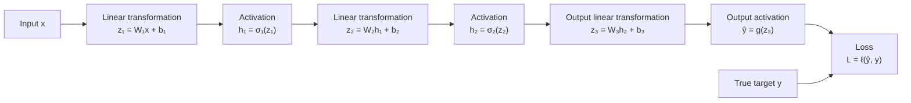
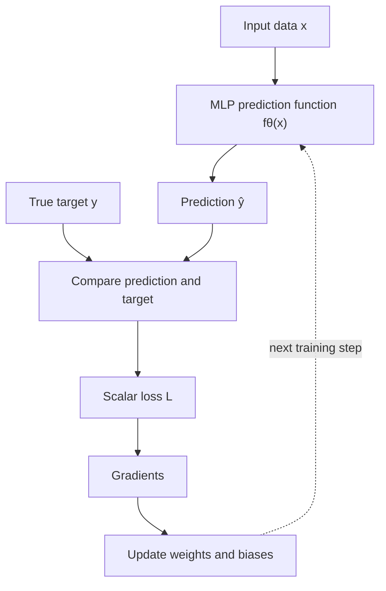
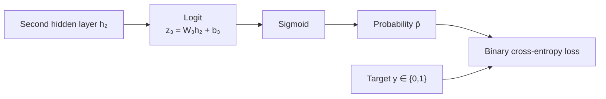
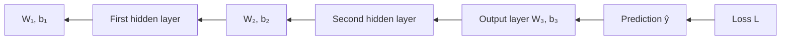
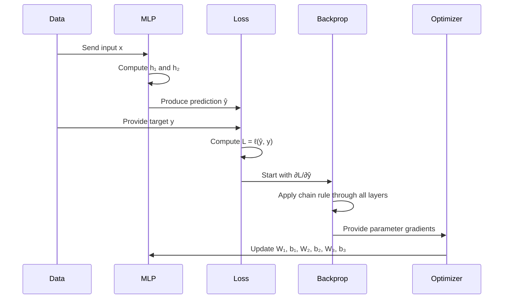

# Understanding Activation Functions and Loss Functions in a Two-Hidden-Layer MLP

## 1. Overview

A multilayer perceptron (MLP) learns a function that maps an input \(x\) to a prediction \(\hat{y}\).

For a two-hidden-layer MLP:

\[
x \rightarrow h_1 \rightarrow h_2 \rightarrow \hat{y}
\]

A common mathematical definition is:

\[
z_1 = W_1x+b_1
\]

\[
h_1 = \sigma_1(z_1)
\]

\[
z_2 = W_2h_1+b_2
\]

\[
h_2 = \sigma_2(z_2)
\]

\[
z_3 = W_3h_2+b_3
\]

\[
\hat{y}=g(z_3)
\]

The final prediction is compared with the true target \(y\) using a loss function:

\[
L=\ell(\hat{y},y)
\]

where:

- \(W_1,W_2,W_3\) are weight matrices;
- \(b_1,b_2,b_3\) are bias vectors;
- \(\sigma_1,\sigma_2\) are hidden-layer activation functions;
- \(g\) is the output activation, when one is needed;
- \(\ell\) is the loss function;
- \(L\) is a scalar measuring prediction error.

---

## 2. Network visualization



The network first computes a prediction. The loss function is then applied **after** the prediction is produced.

---

## 3. Activation functions and loss functions have different roles

Although both can be nonlinear mathematical functions, they answer different questions.

### Activation function

An activation function answers:

> How should a neuron transform the value it receives?

For example, ReLU is:

\[
\sigma(z)=\max(0,z)
\]

It is applied inside the network:

\[
h=\sigma(Wx+b)
\]

### Loss function

A loss function answers:

> How wrong is the model's prediction?

It compares the prediction \(\hat{y}\) with the target \(y\):

\[
L=\ell(\hat{y},y)
\]

For example, squared-error loss is:

\[
L=(\hat{y}-y)^2
\]

### Comparison

| Property | Activation function | Loss function |
|---|---|---|
| Main purpose | Transform a neuron's value | Measure prediction error |
| Typical inputs | Pre-activation value \(z\) | Prediction \(\hat{y}\) and target \(y\) |
| Typical output | Another feature or activation | Usually one scalar loss |
| Location | Inside the network | After the final prediction |
| Examples | ReLU, GELU, sigmoid, tanh | MSE, MAE, Huber, cross-entropy |
| Used during inference | Yes | Usually no |
| Used during training | Yes | Yes |

---

## 4. The loss defines what “good” means

The same MLP architecture can be trained with different loss functions.

Suppose the network produces:

\[
\hat{y}
=
W_3\sigma_2\left(
W_2\sigma_1(W_1x+b_1)+b_2
\right)+b_3
\]

The network itself defines how the prediction is computed.

The loss defines what kind of prediction error should be penalized.



---

## 5. Regression losses

### 5.1 Mean squared error

For one observation:

\[
L=(\hat{y}-y)^2
\]

For a batch of \(N\) observations:

\[
L=
\frac{1}{N}
\sum_{i=1}^{N}
(\hat{y}_i-y_i)^2
\]

The derivative for one observation is:

\[
\frac{\partial L}{\partial \hat{y}}
=
2(\hat{y}-y)
\]

This derivative is the first gradient sent backward through the network.

#### Interpretation

- If \(\hat{y}>y\), the gradient is positive.
- If \(\hat{y}<y\), the gradient is negative.
- A large error produces a large gradient.
- Squaring makes large errors especially costly.

#### Example

Suppose:

\[
y=5,\qquad \hat{y}=4.2
\]

Then:

\[
L=(4.2-5)^2=0.64
\]

and:

\[
\frac{\partial L}{\partial\hat{y}}
=
2(4.2-5)
=
-1.6
\]

The negative gradient indicates that increasing \(\hat{y}\) would reduce the loss.

---

### 5.2 Mean absolute error

For one observation:

\[
L=|\hat{y}-y|
\]

The derivative is:

\[
\frac{\partial L}{\partial\hat{y}}
=
\begin{cases}
1, & \hat{y}>y\\
-1, & \hat{y}<y
\end{cases}
\]

At \(\hat{y}=y\), the function is not differentiable in the ordinary sense, but optimization software can use a subgradient.

#### Interpretation

- Large errors are not squared.
- The gradient magnitude is generally constant.
- MAE is less sensitive to outliers than MSE.

---

### 5.3 Huber loss

Huber loss combines squared error and absolute error.

Let:

\[
e=\hat{y}-y
\]

Then:

\[
L_\delta(e)=
\begin{cases}
\frac{1}{2}e^2, & |e|\leq\delta\\
\delta\left(|e|-\frac{1}{2}\delta\right), & |e|>\delta
\end{cases}
\]

It behaves like:

- MSE for small errors;
- MAE for large errors.

This can make training more stable when the dataset contains outliers.

---

## 6. Classification losses

### 6.1 Binary classification

For binary classification:

\[
y\in\{0,1\}
\]

The output layer first produces a raw score called a **logit**:

\[
z_3=W_3h_2+b_3
\]

A sigmoid converts the logit into a probability:

\[
\hat{p}
=
\sigma(z_3)
=
\frac{1}{1+e^{-z_3}}
\]

Binary cross-entropy is:

\[
L
=
-\left[
y\log(\hat{p})
+
(1-y)\log(1-\hat{p})
\right]
\]



In practice, libraries often combine sigmoid and binary cross-entropy into one numerically stable operation.

For example, PyTorch provides:

```python
torch.nn.BCEWithLogitsLoss()
```

This function expects logits, so a separate sigmoid should not be applied before it.

---

### 6.2 Multiclass classification

Suppose there are \(K\) possible classes.

The output layer produces \(K\) logits:

\[
z=
\begin{bmatrix}
z_1\\
z_2\\
\vdots\\
z_K
\end{bmatrix}
\]

Softmax converts the logits into probabilities:

\[
\hat{p}_k
=
\frac{e^{z_k}}
{\sum_{j=1}^{K}e^{z_j}}
\]

Categorical cross-entropy is:

\[
L
=
-\sum_{k=1}^{K}
y_k\log(\hat{p}_k)
\]

For a one-hot target, this simplifies to:

\[
L=-\log(\hat{p}_{\text{true class}})
\]

The model is penalized when it assigns a low probability to the correct class.

---

## 7. How the loss starts backpropagation

The loss produces a gradient with respect to the model prediction:

\[
\frac{\partial L}{\partial\hat{y}}
\]

This value says:

> If the prediction changes slightly, how much and in which direction will the loss change?

The gradient is then propagated backward through every operation using the chain rule.



For squared error:

\[
L=(\hat{y}-y)^2
\]

the initial gradient is:

\[
\delta_3
=
\frac{\partial L}{\partial\hat{y}}
=
2(\hat{y}-y)
\]

For the output layer:

\[
\hat{y}=W_3h_2+b_3
\]

the gradients are:

\[
\frac{\partial L}{\partial W_3}
=
\frac{\partial L}{\partial\hat{y}}h_2^T
\]

and:

\[
\frac{\partial L}{\partial b_3}
=
\frac{\partial L}{\partial\hat{y}}
\]

The second equality follows because:

\[
\frac{\partial\hat{y}}{\partial b_3}=1
\]

Therefore:

\[
\frac{\partial L}{\partial b_3}
=
\frac{\partial L}{\partial\hat{y}}
\frac{\partial\hat{y}}{\partial b_3}
=
\frac{\partial L}{\partial\hat{y}}\cdot1
\]

---

## 8. Why different losses produce different training behavior

Changing the loss changes the gradient entering the network.

For MSE:

\[
\frac{\partial L}{\partial\hat{y}}
=
2(\hat{y}-y)
\]

For MAE:

\[
\frac{\partial L}{\partial\hat{y}}
=
\operatorname{sign}(\hat{y}-y)
\]

Suppose:

\[
\hat{y}-y=10
\]

Then:

- MSE sends a gradient of \(20\);
- MAE sends a gradient of \(1\).

Suppose instead:

\[
\hat{y}-y=0.1
\]

Then:

- MSE sends a gradient of \(0.2\);
- MAE still sends a gradient of \(1\), except exactly at zero.

Therefore:

- MSE reacts strongly to large errors;
- MAE treats the magnitude of nonzero errors more uniformly;
- Huber provides a compromise.

### Illustrative comparison

| Prediction error \(e=\hat{y}-y\) | Squared loss \(e^2\) | MSE gradient \(2e\) | Absolute loss \(|e|\) | MAE gradient |
|---:|---:|---:|---:|---:|
| \(-10\) | 100 | \(-20\) | 10 | \(-1\) |
| \(-2\) | 4 | \(-4\) | 2 | \(-1\) |
| \(-0.1\) | 0.01 | \(-0.2\) | 0.1 | \(-1\) |
| \(0.1\) | 0.01 | 0.2 | 0.1 | 1 |
| \(2\) | 4 | 4 | 2 | 1 |
| \(10\) | 100 | 20 | 10 | 1 |

---

## 9. Output activation and loss should be chosen together

The hidden activation and loss do not have to be the same function.

However, the output activation and loss should be compatible with the prediction task.

| Task | Output activation | Common loss |
|---|---|---|
| Unbounded regression | None | MSE, MAE, Huber |
| Nonnegative regression | Softplus or exponential | MSE, Poisson loss |
| Binary classification | Sigmoid | Binary cross-entropy |
| Multiclass classification | Softmax | Cross-entropy |
| Multilabel classification | One sigmoid per label | Binary cross-entropy |
| Count prediction | Exponential or Softplus | Poisson negative log-likelihood |

### Example: unrestricted regression

If the target can be any real number:

\[
\hat{y}=W_3h_2+b_3
\]

No output activation is necessary.

### Example: probability prediction

If the output must be between 0 and 1:

\[
\hat{p}=\operatorname{sigmoid}(W_3h_2+b_3)
\]

The sigmoid constrains the output:

\[
0<\hat{p}<1
\]

This makes it suitable for a probability.

---

## 10. Can the loss itself be nonlinear?

Yes.

A loss function can use:

- powers;
- absolute values;
- logarithms;
- exponentials;
- piecewise definitions;
- combinations of several terms.

For example, logistic loss can be written as:

\[
L=\log(1+e^{-y\hat{y}})
\]

This is nonlinear, just as many activation functions are nonlinear.

However, the distinction is based on purpose, not merely mathematical form:

\[
\boxed{
\text{Activation: transforms information inside the model}
}
\]

\[
\boxed{
\text{Loss: evaluates the quality of the final prediction}
}
\]

---

## 11. The full training objective

For a two-hidden-layer regression MLP with ReLU activations and squared-error loss:

\[
h_1
=
\operatorname{ReLU}(W_1x+b_1)
\]

\[
h_2
=
\operatorname{ReLU}(W_2h_1+b_2)
\]

\[
\hat{y}
=
W_3h_2+b_3
\]

\[
L
=
(\hat{y}-y)^2
\]

Substituting the entire network into the loss gives:

\[
L
=
\left[
W_3
\operatorname{ReLU}
\left(
W_2
\operatorname{ReLU}(W_1x+b_1)
+b_2
\right)
+b_3-y
\right]^2
\]

Training finds parameters:

\[
\theta=
\{W_1,b_1,W_2,b_2,W_3,b_3\}
\]

that minimize the average loss over the training data:

\[
\theta^*
=
\arg\min_{\theta}
\frac{1}{N}
\sum_{i=1}^{N}
\ell(f_\theta(x_i),y_i)
\]

---

## 12. One complete training step



In words:

1. Send the input through the MLP.
2. Produce a prediction.
3. Compare the prediction with the target.
4. Calculate the scalar loss.
5. Differentiate the loss with respect to every parameter.
6. Update the parameters.
7. Repeat with more training examples.

---

## 13. Minimal PyTorch example

```python
import torch
import torch.nn as nn

# Two-hidden-layer MLP
model = nn.Sequential(
    nn.Linear(3, 4),
    nn.ReLU(),
    nn.Linear(4, 2),
    nn.ReLU(),
    nn.Linear(2, 1),
)

# Regression loss
loss_fn = nn.MSELoss()

# Parameter-update method
optimizer = torch.optim.Adam(model.parameters(), lr=0.001)

x = torch.tensor([[2.0, 1.0, 3.0]])
y = torch.tensor([[5.0]])

# 1. Forward pass
prediction = model(x)

# 2. Compare prediction with target
loss = loss_fn(prediction, y)

# 3. Clear gradients from the previous step
optimizer.zero_grad()

# 4. Compute gradients using backpropagation
loss.backward()

# 5. Update all weights and biases
optimizer.step()
```

The key lines are:

```python
loss = loss_fn(prediction, y)
```

This defines how prediction quality is measured.

```python
loss.backward()
```

This calculates:

\[
\frac{\partial L}{\partial W_1},
\frac{\partial L}{\partial b_1},
\frac{\partial L}{\partial W_2},
\frac{\partial L}{\partial b_2},
\frac{\partial L}{\partial W_3},
\frac{\partial L}{\partial b_3}
\]

```python
optimizer.step()
```

This uses those gradients to update the parameters.

---

## 14. Main takeaway

The MLP and the loss function form two connected but distinct parts of training:

```text
Input
  ↓
MLP with linear layers and activation functions
  ↓
Prediction
  ↓
Loss function compares prediction with target
  ↓
Gradient
  ↓
Backpropagation updates the MLP
```

The central distinction is:

> **Activation functions determine how the network constructs a prediction. Loss functions determine what kind of prediction the training process should prefer.**

The loss can have many different forms. Choosing a different loss changes the gradient signal and therefore changes what the model learns, even when the MLP architecture remains unchanged.
